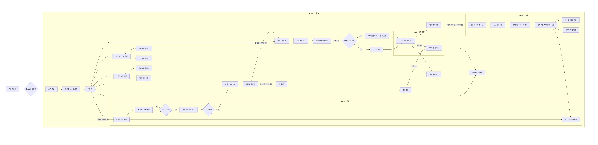
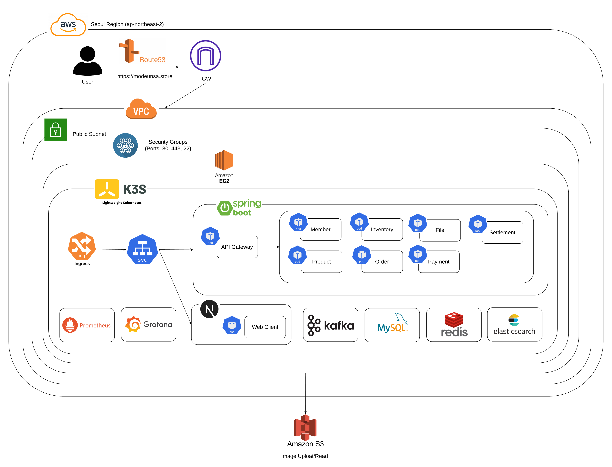
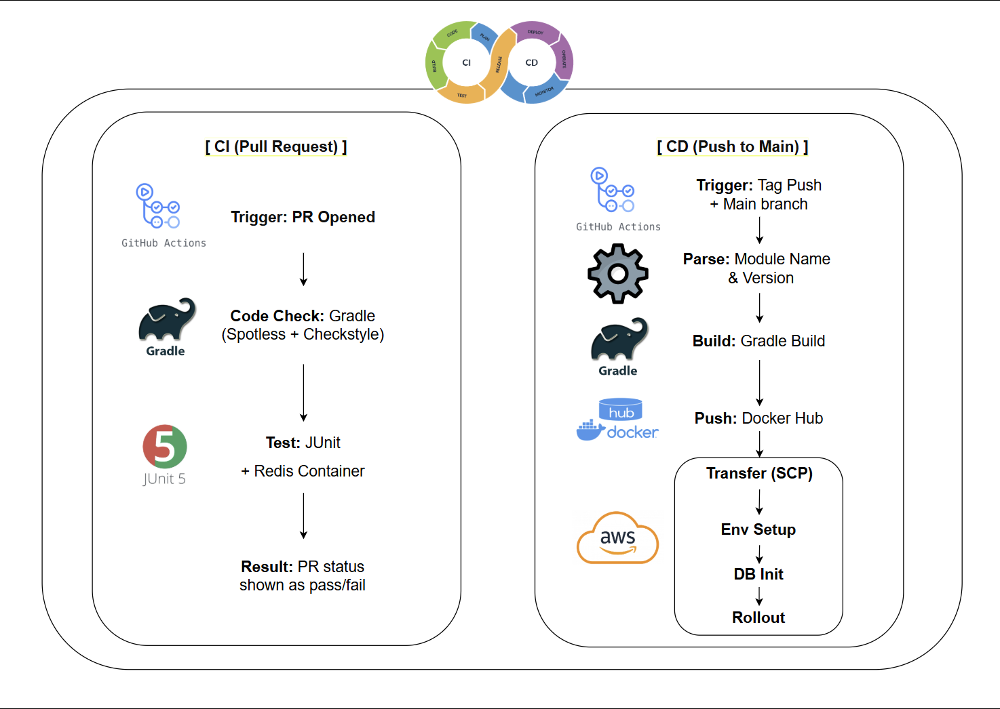

# 🛍️ 뭐든사

## 1. Service Overview
<!-- (무엇을 만드는 서비스인가) -->
본 프로젝트 [뭐든사](https://modeunsa.store)는 패션·뷰티 상품을 중심으로 한 이커머스 플랫폼으로, 백엔드 아키텍처 설계와 도메인 분리에 중점을 두어 개발된 서비스입니다.

상품, 컨텐츠, 주문, 결제, 정산, 회원 등 주요 도메인을 명확히 분리하여 설계하였으며, 도메인 간 결합도를 낮추기 위해 이벤트 기반 구조를 적용했습니다.

현재는 기본적인 커머스 기능에 집중한 MVP 단계이며, 향후 라이브 커머스, 콘텐츠 연계 쇼핑, 개인화 추천 기능 등으로 확장할 수 있는 구조를 갖추고 있습니다.

## 2. Problem Statement
<!-- (어떤 문제를 해결하려 했는가) -->
기존 패션/뷰티 커머스 플랫폼은 다음과 같은 한계를 가진다.

- 도메인 간 강결합으로 확장 시 리스크 증가
- 주문/결제/정산 흐름에서 장애 전파
- 실시간 트래픽 대응이 어려운 구조

본 프로젝트는 위 문제를 해결하기 위해
이벤트 기반 도메인 분리 구조를 채택하였다.

## 3. Core Features
- API Gateway
  - API 라우팅 및 인증·인가 처리
- Auth
  - OAuth2 기반 소셜 로그인, 로그아웃
  - 소셜 계정 연동 (하나의 회원에 다수 소셜 계정 연결 가능)
  - 회원, 판매자, 관리자 등 권한 관리 및 권한별 API 접근 제어
- 회원
  - 회원 기본 정보 관리(조회, 수정)
  - 회원 프로필 관리(생성, 조회, 수정)
  - 회원 배송지 주소 관리(생성, 조회, 수정, 삭제)
  - 판매자 등록 신청
- 상품
  - 카테고리 기반 상품 조회 및 관심상품 관리
- 컨텐츠
  - 컨텐츠 관리 및 검색
- 주문
  - 주문 관리 및 장바구니 관리
- 결제
  - 예치금 관리
  - PG사 연동을 통한 결제 처리
- 정산
  - Batch를 활용한 정산 처리

## 4. User Flow

## 5. System Architecture Diagram

## 6. Infrastructure Architecture Diagram

## 7. CICD Diagram

## 8. Design Principles
<!-- (왜 이런 구조인가) -->

- Domain Isolation: 각 도메인은 독립적으로 진화
- Domain Driven Design: 도메인 간 직접 참조 제거
- Idempotent Event Handling: 중복 이벤트에도 안전
- Clear Role Separation: Member / Seller / Admin / System / Holder

## 9. Tech Stack
<!-- (선택 이유 중심) -->

- MSA로의 확장성 고려: 도메인 단위로 분리된 구조 (Bounded Context)
- 도메인 이벤트 기반 비동기 처리 (Spring Event)
- Spring Security & OAuth 2.0 기반의 통합 인증·인가
- JWT(JSON Web Token)를 활용한 무상태(Stateless) 인증
- 민감 정보 암호화: AES-GCM 방식 적용
- 동시성 문제 해결: 재고·결제 처리에 대한 비관적 락 적용
- 부하 분산을 위한 비동기 처리: Spring Batch 와 scheduler를 활용하여 정산 처리
- 조회 속도 향상: ElasticSearch 를 활용한 검색 도입

## 10. Trade-offs & Limitations
<!-- (현실적 판단) -->
- 초기에는 단일 DB 기반 이벤트 처리
- Exactly-once 보장 대신 at-least-once 전략 채택
- 실시간 정산이 아닌 배치 기반 정산

## 11. Future Improvements
<!-- (Kafka, CQRS, Scale-out) -->
- 라이브 커머스 기능 도입
- 콘텐츠 기반 상품 추천
- 재고 도메인 분리
- Kafka 기반 이벤트 처리
- MSA 도입
- 성능 테스트

## 12. Deep Dive Docs
<!-- 기술 README 링크 -->
각 기술 및 설계 결정에 대한 상세 내용은 아래 문서에서 확인할 수 있습니다.

### 코드 컨벤션 강제 적용
* [checkstyle & spotless](./docs/checkstyle.md)

### 자동 Mapper 도입
* [mapstruct](./docs/mapstruct.md)

### 민감 정보 암호화 적용
* [AES-GCM 암호화](./docs/aesgcm.md)
* [암호화 키 관리](./docs/encryption.md)

### ElasticSearch 도입
* [ElasticSearch](./docs/elasticsearch.md)

### Docker 및 Docker Compose 가이드
* [Docker 및 Docker Compose 가이드](./docs/docker.md)

### CI 가이드
- [CI 가이드](docs/ci.md)

### CD 가이드
- [CD 가이드](docs/deploy.md)

### AWS 인프라 아키텍처
* [AWS 인프라 아키텍처](./docs/aws_architecture.md)

### Nginx 설정
* [Nginx 설정](./docs/nginx.md)

### Spring Security + JWT 인증 시스템
* [Spring Security + JWT 인증 시스템](./docs/security_jwt.md)

### OAuth2 소셜 로그인 및 계정 연동
* [OAuth2 소셜 로그인 및 계정 연동](./docs/oauth2.md)

### API Gateway 라우팅 및 인증/인가 전략
* [API Gateway 라우팅 및 인증/인가 전략](./docs/api_gateway.md)
